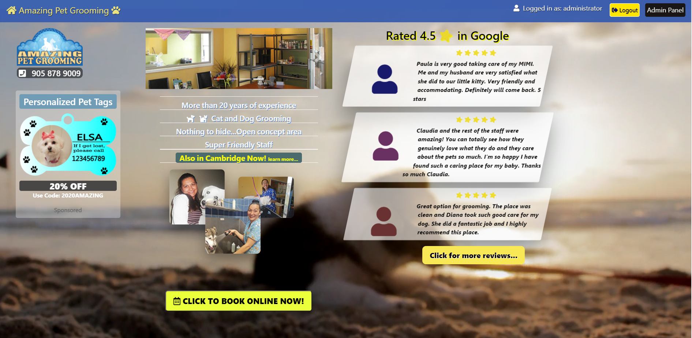
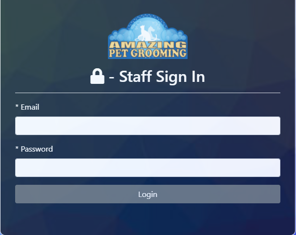
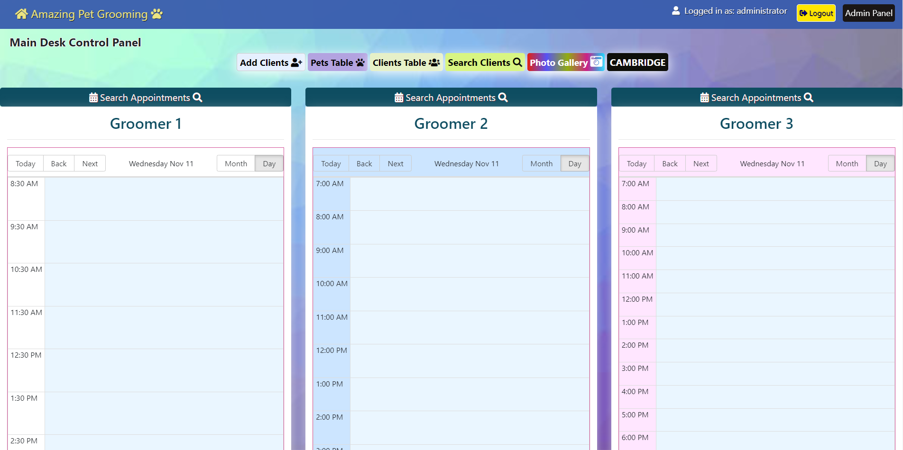
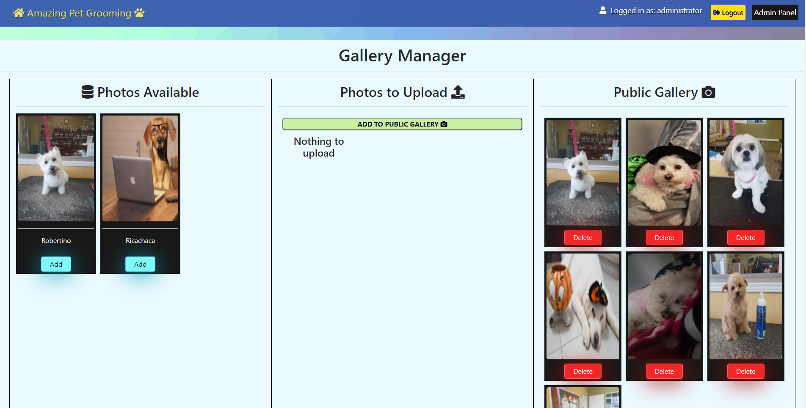
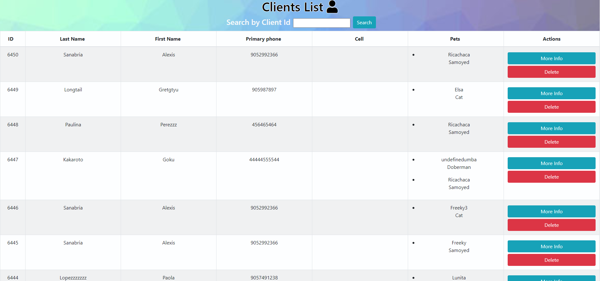
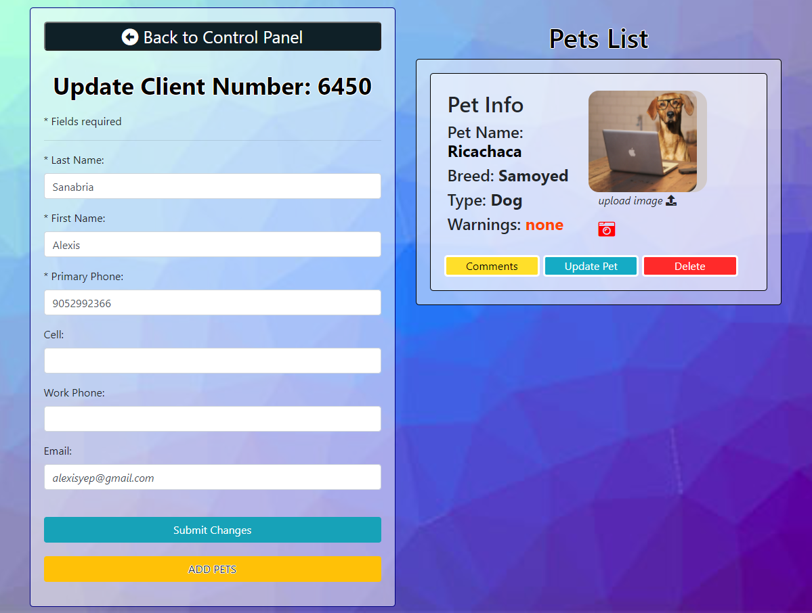
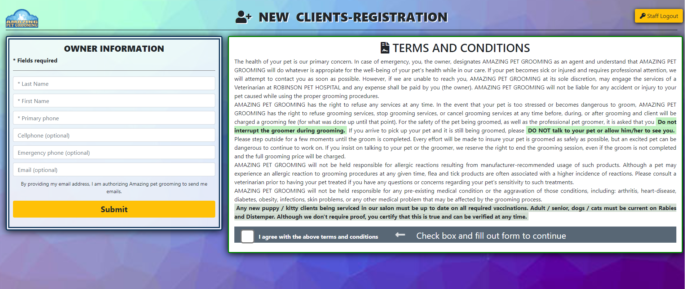

# Pet Grooming Web Application

Full Stack application with a MySql Database, authentication, appointment scheduling system, and real life problem solving features.

This application was created for a real pet grooming business to solve a number of issues they were facing before.
 
Note: The code on this repository is exactly the same as the one being used in production for the business; however this repo is hosted in heroku using a different domain name and database than the one being used in the real app.

# Link to live site for this repo

(Note: As it is hosted using the Free Dynos version, please be patient until the app wakes up. Once it loads after being asleep for a while, the app will run smoothly and fast)

https://pet-grooming-public-repo.herokuapp.com/ 

### Credentials to test the protected pages are:

- Admin (Has full access to all routes/areas)
  Email: alexsanabria@fullstackdev.com  
  Password: 123456
   

- Receptionist (Can access the receptionist control panel)
  Email: maryJohnson@gmail.com  
  Password: 123456
   

- Groomer 1 (Can only access her/his calendar)
  Email: nathalies@gmail.com  
  Password: 123456
   

- Groomer 2 (Can only access her/his calendar)
  Email: peterpan@gmail.com  
  Password: 123456
   

- Customer (Can only have access to the Client-registration page)
  Email: client@gmail.com  
  Password: 123456
   

# Issues this business faced before implementing this application

- Employees' schedule was handled by writting manually on a physical book
- Client's ppointments were booked using the same physical book by hand
- Staff only had access to clients database locally from one computer
- Physical files were over 6000 and the number was increasing rapidily occupying too much actual space on the shelves
- In the event of a fire or robbery, all records could have been lost with no possible way to recover
- For every pet, the clients needed to fill out a separate form to keep records of the services provided
- The static website they had was not responsive to small screens

# Approaching the problems

### Database type

The existing clients database on the local computer had the option to be extracted as a Excel format, therefore, I was able to convert it into csv format and import it into MySql Workbench to avoid the need to manually enter the 6000+ clients into our dabatase.
 

#### MySql Tables and GraphQl Server

- I created one table for Users: one for each Groomer/employee to connect with their own calendar.
- Three tables to handle Customers associating them like this: One for clients(has many pets), one for pets (belong to clients, and has many comments), and one for comments (belong to pets).
- 3 tables to handle the groomers commissions
- 1 table for the Photo gallery
- A GraphQl Server was implemented to help speedup some of the queries to the Database and reduce the Rest API calls

# Authentication

Authentication was implemented using JWT, and Passport Js, where the staff member will be redirected to different areas of the page depending on the role assigned by the admin.

The admin will have access to all features and routes

The receptionist will be redirected to the receptionist control panel where different options are provided:

- Handle Calendars for each staff member to handle their hours and add appointments separately
- Search clients forms to search by Phone number, First Name, Last Name, Pet Name, or breed.
- Add New clients form
- Clients list. A table that has the option to filter rows by client number, phone, etc. Each client has the More Info Button that will redirect the user to the Full page with the client information.

- Photo Gallery Management

  

  From the Gallery Management page the user can choose which photos are going to be displayed in the public gallery, based on the photos uploaded to the pets who's owners gave permission to do so at registration time.

# Clients List

 

# Client Information Page

On this page, the full client information is shown. From here, the staff member can edit the clients information, add pets to this client and see existing pets. Every Pet has their own comment section (Equivalent to the back of the client physical file to keep records of their services). 
If a pet has not had a comment added yet, the Pet's name will be Black, on the contrary, it will be green. This feature was integrated to help them identify easily which pet has already comments and which ones doesn't. 

# Clients get registered by themselves

The clients registration page is accessed by logging in as a customer. A computer in the reception is used for this sole purpose. This feature was added to limit contact between staff members and clients during to the Covid-19 pandemic

# Separate Roles Privilages

The authentication system is implemented to grant access to different pages based on roles: Admin or employees; admin will have access to all pages, whilst the employees will only have access to other areas of the site

# Clients Booking System

Clients can book appointments online by choosing from two different cities, and selecting the type of pet to be groomed. Then, the calendar will load the groomers availability previously set to show the clients when they can book their appointments.

# Thecnologies Used

## Front End

- React JS
- Html
- Javascript
- Css
- SASS
- Bootstrap
- Apollo Client
- Adobe Illustrator and Photoshop

## Back End

- Node Js
- Express
- MySql
- GraphQL
- Sequelize
- Passport Js
- JWT

## Deployment

Netlify at first to support the static pages only, and then it was transfered to Heroku for database support

# Link to live site on Heroku

(Note: As it is hosted using the Free Dynos version, please be patient until the app wakes up. Once it loads after being asleep for a while, the app will run smoothly and fast)

https://pet-grooming-public-repo.herokuapp.com/

Credentials to test the protected components are:

- Admin  
  Email: alexsanabria@fullstackdev.com  
  Password: 123456

- Receptionist (Can access the receptionist control panel)
  Email: maryJohnson@gmail.com  
  Password: 123456
   

- Groomer 1 (Can only access her/his calendar)
  Email: nathalies@gmail.com  
  Password: 123456
   

- Groomer 2 (Can only access her/his calendar)
  Email: peterpan@gmail.com  
  Password: 123456
   

- Customer (Can only have access to the Client-registration page)
  Email: client@gmail.com  
  Password: 123456
   
